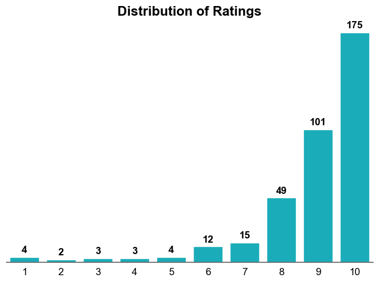
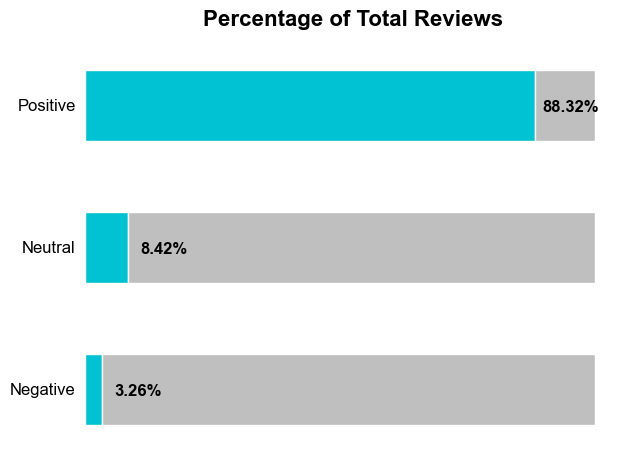
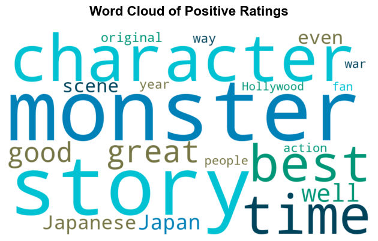
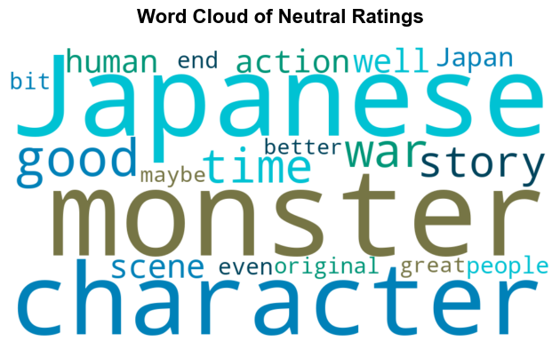
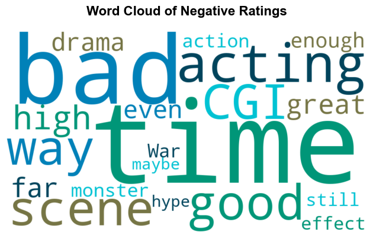
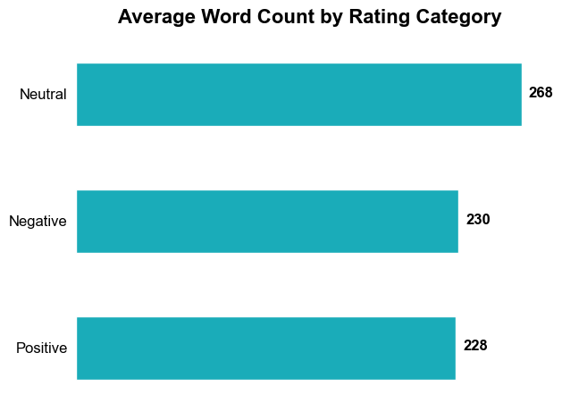

# Analysis of the Godzilla Minus One Reviews on IMDb

## Table of Contents

- [Introduction](#introduction)
- [Objective](#objective)
- [Data source](#data-source)
- [Methods](#methods)
- [Tools](#tools)
- [Analysis results](#analysis-results)
- [What can be improved](#what-can-be-improved)
- [Jupyter Notebook](#jupyter-notebook)

## Introduction

Godzilla Minus One, the latest movie produced by Toho Studios featuring this iconic character, which was released on November 3rd in Japan, December 1st in the U.S., and December 28th in Mexico, has been a huge success, becoming the highest grossing Japanese Godzilla movie to date, earning over $78 million, and was personally one of my favorite movies of 2023, so I was really interested in knowing other people's opinions about the film, which motivated me to build this project to develop my data analysis skills and knowledge.

## Objective

Analyze IMDb users' Godzilla Minus One reviews to answer the following key questions:

- How are the ratings distributed?
- What percentage of reviews are positive?
- What percentage of reviews are neutral?
- What percentage of reviews are negative?
- What are the most common words in positive reviews?
- What are the most common words in neutral reviews?
- What are the most common words in negative reviews?
- What is the average number of words in each rating category?

## Data source

The "godzilla_reviews" dataset was created by scraping data from the [Internet Movie Database (IMDb) page](https://www.imdb.com/title/tt23289160/?ref_=tt_urv).

The dataset can be found [here](https://github.com/AlexVegaR/Analysis-of-the-Godzilla-Minus-One-Reviews-on-IMDb/tree/main/dataset).

## Methods

- Data gathering
- Data wrangling
- Exploratory data analysis
- Data visualization

## Tools

- **Python**: Scrapset, Numpy, Pandas, Matplotlib, Seaborn, Wordcloud

## Analysis results

With an average rating of 8.9 in this dataset, the most common rating for the movie was 10 with 175 occurrences, while the least common rating was 2 with 2 occurrences.

The reviews were divided into three categories according to their ratings: "Positive" for ratings greater than or equal to 8, "Neutral" for ratings greater than or equal to 5 and less than or equal to 7, and "Negative" for ratings less than or equal to 4.

Of the total reviews in this dataset, 88.32% were "Positive" with 323 reviews, 8.42% were "Neutral" with 31 reviews, and 3.26% were "Negative" with 12 reviews.

The words that stand out the most in the positive reviews are "Character", "Monster" and "Story", which indicate the main reasons why people liked the movie.

As in the positive reviews, "Monster" and "Character" are the most prominent words in the neutral reviews, as well as the word "Japanese", which indicate the main reasons why people liked or disliked the movie.

The most prominent words in the negative reviews are "Bad", "Acting", "CGI" and "Time", which indicate the main reasons why people disliked the movie. Despite being in the negative reviews, "Good" and "Great" are also among the words that stand out the most.

On average, a review has 232 words. "Neutral" reviews have the most average words with 268, "Negative" reviews are second with 230, and "Positive" reviews have the least average words with 228.

## What can be improved

The reviews listed as spoilers by users on IMDb are automatically excluded in the scraping process, so this project does not fully reflect the overall opinion of the movie. I could try another scraping method to fully gather all reviews on the site.

## Jupyter Notebook

The Jupyter Notebook used in this project can be found [here](https://github.com/AlexVegaR/Analysis-of-the-Godzilla-Minus-One-Reviews-on-IMDb/blob/main/jupyter_notebook/Godzilla_%20IMDB_Reviews_Analysis.ipynb).
